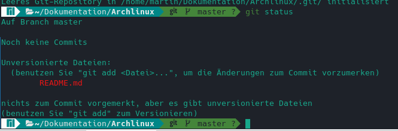

# Archlinux Installation (VirtualBox)

### Tastatur Layout
	loadkeys de-latin1
### erstes Bild

### Überprüfen wie die Festplatte heißt

	lsblk
### Datenbank refreshen
	pacman -Syy
### Mirros aktualisieren (refelctor)
	reflector -c Germany -a 6 --sort rate --save /etc/pacman.d/mirrorlist
### Datenbank refresh
	pacman -Syy
### Partitionierungtools starten
	cfdisk /dev/sda
gpt Partitionstabelle erstellen
1. 300MB >> EFI >> EFI System
2. 4GB >> SWAP >> LLinux Swapp
3. 30GB >> / LinuxFilesystem
4. Rest >> /home LinuxFileSystem
5. Write >> Quit
	lsblk
### Partitionsformat
	mkfs.fat -F32 /dev/sda1
	mkswap /dev/sda2
	swapon /dev/sda2
	mkfs.ext4 /dev/sda3
	mkfs.ext4 /dev/sda4
